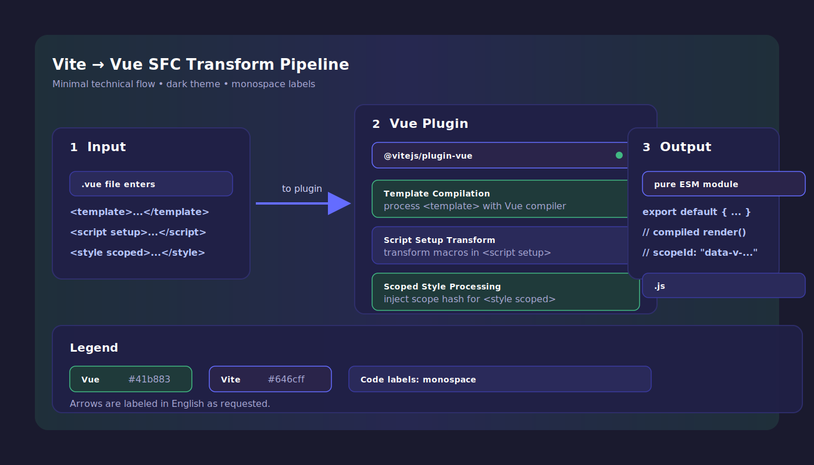
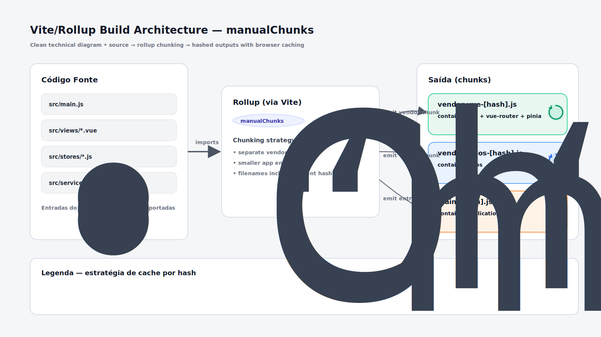
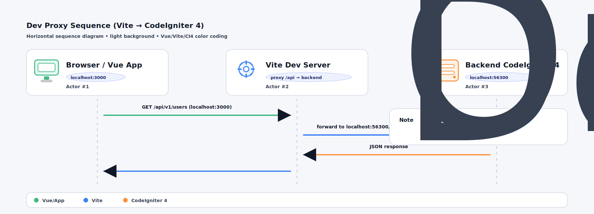

[← Voltar ao README Principal](C:\laragon\www\php\habilidade\projeto56300\src\public\frontend\vue_vite_pinia\README.md)

---

# Vite Config JS — Documentação Técnica

> **Arquivo de referência:** `vite.config.js`
> **Caminho completo:** `C:\laragon\www\php\habilidade\projeto56300\src\public\frontend\vue_vite_pinia\vite.config.js`

---

## Nível Básico — O que é o `vite.config.js`?

O `vite.config.js` é o **arquivo de configuração central do Vite**. Ele é executado apenas durante o processo de build ou ao iniciar o servidor de desenvolvimento — nunca no navegador do usuário.

Através dele você controla:

- Quais **plugins** o Vite deve usar (ex: suporte ao Vue)
- O **caminho base** (`base`) dos assets em produção
- O **alias** de caminhos (`@` → `src/`)
- O **servidor de desenvolvimento** (porta, proxy)
- O **pipeline de build** (minificação, chunking, saída)

```
┌────────────────────────────────────────────────────────────────┐
│                        vite.config.js                          │
│                                                                │
│  plugins → habilita Vue SFC (.vue files)                       │
│  base    → URL raiz dos assets (dev vs produção)               │
│  resolve → alias de caminhos (@)                               │
│  build   → configuração do bundle de produção                  │
│  server  → porta e proxy para o backend                        │
│  optimizeDeps → pré-bundling de dependências                   │
└────────────────────────────────────────────────────────────────┘
```

---

## Análise Linha a Linha

### Linha 1–3 — Imports

```js
import { defineConfig, loadEnv } from "vite";
import vue from "@vitejs/plugin-vue";
import { resolve } from "path";
```

| Import         | Origem               | Função                                                         |
| -------------- | -------------------- | -------------------------------------------------------------- |
| `defineConfig` | `vite`               | Envolve a config com tipagem e IntelliSense                    |
| `loadEnv`      | `vite`               | Carrega variáveis `.env` por modo (`development`/`production`) |
| `vue`          | `@vitejs/plugin-vue` | Habilita o processamento de arquivos `.vue` (SFC)              |
| `resolve`      | `path` (Node.js)     | Resolve caminhos absolutos no sistema de arquivos              |

---

### Linhas 5–14 — Comentário de Documentação

```js
/**
 * Configuração central do Vite.
 *
 * base automático por modo:
 *   npm run dev   → mode = 'development' → base = '/'
 *   npm run build → mode = 'production'  → base = '/frontend/vue_vite_pinia/dist/'
 *
 * .env.development é usado apenas em DEV (nunca sobe para o servidor).
 * Em produção, não há dependência de variáveis de ambiente.
 */
```

Documenta o comportamento dinâmico da configuração baseado no **modo de execução**.

---

### Linha 15 — `defineConfig` com função por modo

```js
export default defineConfig(({ mode }) => {
```

- `defineConfig` aceita um **objeto** ou uma **função**.
- Quando passado como função, recebe `{ mode, command, ssrBuild }`.
- `mode` vale `'development'` no `npm run dev` e `'production'` no `npm run build`.
- Isso permite **configurações dinâmicas** diferentes por ambiente.

---

### Linha 17 — `loadEnv`

```js
const env = loadEnv(mode, process.cwd(), "");
```

| Parâmetro       | Valor                             | Descrição                                                     |
| --------------- | --------------------------------- | ------------------------------------------------------------- |
| `mode`          | `'development'` ou `'production'` | Define qual `.env` carregar                                   |
| `process.cwd()` | raiz do projeto                   | Diretório onde os arquivos `.env` estão                       |
| `''` (prefixo)  | string vazia                      | Carrega **todas** as variáveis, não só as com prefixo `VITE_` |

> **Atenção:** Ao usar prefixo `''`, variáveis sensíveis também são lidas. Neste projeto, somente `VITE_API_BASE_URL` é usada na config.

---

### Linha 19 — Flag `isDev`

```js
const isDev = mode === "development";
```

Flag booleana reutilizada para decidir entre configurações de dev e produção ao longo do arquivo.

---

### Linha 22 — `plugins`

```js
plugins: [vue()],
```

- Registra o **plugin oficial do Vue 3** para o Vite.
- Habilita o compilador de Single File Components (`.vue`).
- Suporta `<script setup>`, `<template>`, `<style scoped>`, HMR (Hot Module Replacement).



---

### Linhas 27 — `base`

```js
base: isDev ? '/' : '/frontend/vue_vite_pinia/dist/',
```

| Modo          | Valor de `base`                  | Resultado                                                                    |
| ------------- | -------------------------------- | ---------------------------------------------------------------------------- |
| `development` | `/`                              | Assets servidos em `http://localhost:3000/assets/...`                        |
| `production`  | `/frontend/vue_vite_pinia/dist/` | Assets servidos em `http://servidor/frontend/vue_vite_pinia/dist/assets/...` |

> O `base` é **injetado automaticamente** em todas as referências de assets no HTML e CSS gerados.

---

### Linhas 29–33 — `resolve.alias`

```js
resolve: {
  alias: {
    '@': resolve(__dirname, 'src'),
  },
},
```

- Define o alias `@` apontando para a pasta `src/`.
- Permite imports limpos em qualquer arquivo do projeto:

```js
// Sem alias (frágil — quebra se mover o arquivo)
import UserService from "../../../services/userService.js";

// Com alias (robusto — sempre relativo à raiz de src/)
import UserService from "@/services/userService.js";
```

---

### Linhas 36–53 — `build`

```js
build: {
  outDir: 'dist',
  emptyOutDir: true,
  sourcemap: false,
  minify: 'terser',
  chunkSizeWarningLimit: 1000,
  rollupOptions: { ... }
}
```

| Opção                   | Valor      | Descrição                                        |
| ----------------------- | ---------- | ------------------------------------------------ |
| `outDir`                | `'dist'`   | Pasta de saída do build                          |
| `emptyOutDir`           | `true`     | Limpa `dist/` antes de cada build                |
| `sourcemap`             | `false`    | Desativa mapas de código em produção (segurança) |
| `minify`                | `'terser'` | Usa Terser para minificação agressiva do JS      |
| `chunkSizeWarningLimit` | `1000`     | Alerta se um chunk ultrapassar 1000 KB           |

---

### Linhas 42–51 — `rollupOptions` (Nível Avançado)

```js
rollupOptions: {
  output: {
    manualChunks: {
      'vendor-vue':   ['vue', 'vue-router', 'pinia'],
      'vendor-axios': ['axios'],
    },
    chunkFileNames: 'assets/[name]-[hash].js',
    entryFileNames: 'assets/[name]-[hash].js',
    assetFileNames: 'assets/[name]-[hash].[ext]',
  },
},
```

#### `manualChunks` — Separação manual de bundles

Divide as dependências em **chunks separados** para maximizar o cache do navegador:

| Chunk             | Bibliotecas                  | Estratégia                               |
| ----------------- | ---------------------------- | ---------------------------------------- |
| `vendor-vue`      | `vue`, `vue-router`, `pinia` | Raramente mudam → cache de longa duração |
| `vendor-axios`    | `axios`                      | Isolado para update independente         |
| _(código da app)_ | Seus `.vue` e `.js`          | Muda a cada deploy                       |

> Se o usuário já visitou o site, o browser reutiliza `vendor-vue-[hash].js` do cache. Apenas o chunk da aplicação é rebaixado.

#### Nomenclatura com hash

```
assets/vendor-vue-Bx8kL9mP.js    ← hash muda só se o conteúdo mudar
assets/main-Qw2rT4vN.js
assets/logo-Kp5yU7eR.png
```

O hash garante **cache busting automático**: o browser baixa o arquivo novo somente quando o conteúdo realmente mudou.



---

### Linhas 57–67 — `server`

```js
server: {
  port: 3000,
  proxy: {
    '/api': {
      target: env.VITE_API_BASE_URL || 'http://localhost:56300',
      changeOrigin: true,
      secure: false,
    },
  },
},
```

| Opção                  | Valor          | Descrição                                         |
| ---------------------- | -------------- | ------------------------------------------------- |
| `port`                 | `3000`         | Servidor de dev em `http://localhost:3000`        |
| `proxy['/api'].target` | URL do backend | Redireciona chamadas `/api/*` para o CodeIgniter  |
| `changeOrigin`         | `true`         | Ajusta o header `Host` para evitar bloqueios CORS |
| `secure`               | `false`        | Aceita certificados SSL autoassinados no dev      |

**Fluxo do proxy:**

```
Vue (porta 3000)                 Backend CI4 (porta 56300)
    │                                        │
    │  GET /api/v1/users  ──────────────────►│
    │                       proxy invisível  │
    │◄──────────────────── JSON response ────│
```

> O proxy **só existe em desenvolvimento**. Em produção o Apache faz o roteamento.



---

### Linhas 69–71 — `optimizeDeps`

```js
optimizeDeps: {
  include: ['vue', 'vue-router', 'pinia', 'axios'],
},
```

- Lista de dependências que o Vite deve **pré-processar** na primeira execução.
- Converte módulos CommonJS para ESM e os bundla antecipadamente.
- Resultado: **primeira carga do dev server muito mais rápida** (sem processar cada dep sob demanda).

---

## Nível Avançado — Otimizações e Boas Práticas

### 1. Cache de Dependências vs Cache de Módulos

| Tipo                        | Local                 | Validade                       |
| --------------------------- | --------------------- | ------------------------------ |
| `optimizeDeps` (pre-bundle) | `node_modules/.vite/` | Até mudança no `package.json`  |
| Chunks de produção (build)  | `dist/assets/`        | Até mudança no conteúdo (hash) |
| Cache do browser            | Memória/Disco         | Controlado pelos headers HTTP  |

### 2. Adicionando mais chunks

Para projetos grandes, considere separar bibliotecas de UI:

```js
manualChunks: {
  'vendor-vue':      ['vue', 'vue-router', 'pinia'],
  'vendor-axios':    ['axios'],
  'vendor-ui':       ['bootstrap', '@popperjs/core'],  // exemplo
  'vendor-charts':   ['chart.js'],                     // exemplo
}
```

### 3. Ativando sourcemaps somente em staging

```js
sourcemap: mode === 'staging' ? 'inline' : false,
```

### 4. Variáveis de ambiente disponíveis no código Vue

Apenas variáveis com prefixo `VITE_` são expostas ao código do browser:

```js
// .env.development
VITE_API_BASE_URL=http://localhost:56300
VITE_APP_TITLE=Meu App

// Em qualquer .vue ou .js
console.log(import.meta.env.VITE_API_BASE_URL)
console.log(import.meta.env.VITE_APP_TITLE)
```

---

[← Voltar ao README Principal](C:\laragon\www\php\habilidade\projeto56300\src\public\frontend\vue_vite_pinia\README.md)
